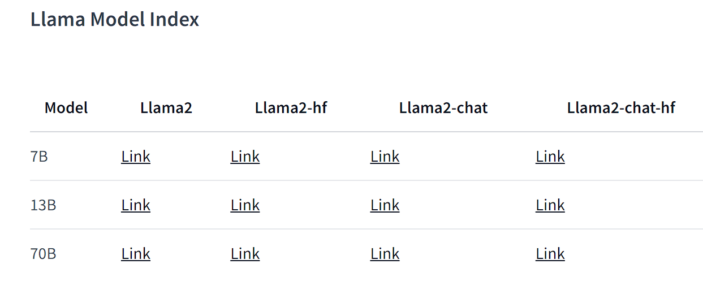
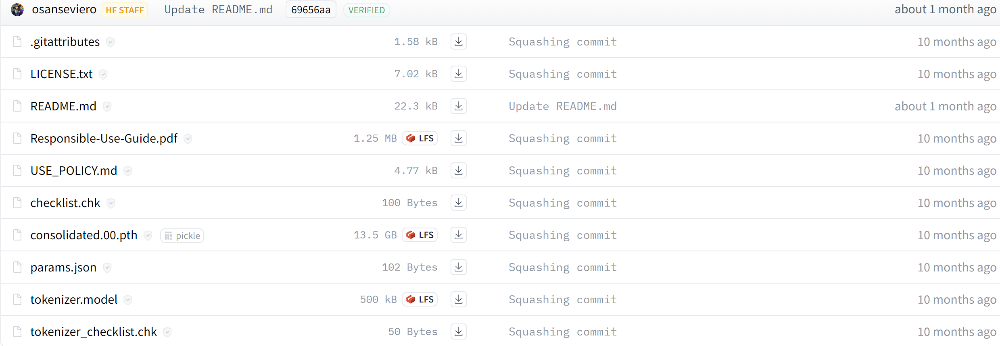

# llama2-7B

#### **Windows11**

+ python==3.10.8
+ torch==2.1.0
+ cmake==3.28.1
+ make==4.4.1
+ gcc version 8.1.0 (x86_64-posix-seh-rev0, Built by MinGW-W64 project)

```latex
# 创建虚拟环境
conda create -n llma2 python==3.10.8
# 启动虚拟环境
conda activate llma2
# 下载相关包
pip install -r requirements.txt -i https://pypi.tuna.tsinghua.edu.cn/simple

# anaconda prompt常用密令
清屏：cls
列出当前文件夹内容：dir
复制什么的就自己使用help查看详情吧！
```

```latex
# 添加环境变量
make -v
cmake --version
gcc -v
```

模型转化，量化

```latex
# 用这位巨佬的项目
git clone https://github.com/ggerganov/llama.cpp
cd llama.cpp
# 编译
cmake . -G "MinGW Makefiles"
cmake --build . --config Release
# 此时你可以看到bin目录下出现了很多exe文件，但是我们最主要使用的就main.exe，quantize.exe
```

下载模型如下,第一次下载需要申请，当然你也可以找一些非官方的的库下载，我在llama的hugging face仓库中下载对应的模型，我所使用的是 [llama2-7B](https://huggingface.co/meta-llama/Llama-2-7b/tree/main)



```latex
下载最主要的3个文件，在llama2.cpp中的创建一个 testmodels/llama2-7b 的文件夹并将下述3个文件放入llama2-7b中
结构如下
llama.cpp
 -...
 ...
 -testmodels
 	-llama2-7b
 		-consolidated.00.pth
		-params.json
		-tokenizer.model
```



```latex
软件依赖安装完成！
llama项目编译成功！
模型下载完成并放到testmodels文件夹！
# 转化
cd llama.cpp
conda activate llama2
# 注意在你的虚拟环境下执行！！！
python convert.py testmodels/llama2-7b/ --outfile testmodels/llama2-7b/llama2-7b.bin
# 量化
bin\quantize.exe testmodels/llama2-7b/llama2-7b.bin testmodels/llama2-7b/llama2-7b_res.bin q4_0
# 和Bob对话
bin\main.exe -m testmodels/llama2-7b/llama2-7b_res.bin -n 256 --repeat_penalty 1.0 --color -i -r "User:" -f prompts/chat-with-bob.txt

```

#### **Linux(Ubuntu22.04)**

+  make -v==GNU Make 4.3
+ gcc -v==gcc version 11.4.0 (Ubuntu 11.4.0-1ubuntu1~22.04) 
+ cmake --version==cmake version 3.22.1

```latex
git clone https://github.com/ggerganov/llama.cpp
cd llama.cpp
make
# 转化
python convert.py testmodels/llama2-7b/ --outfile testmodels/llama2-7b/llama2-7b.bin
# 量化
./quantize testmodels/llama2-7b/llama2-7b.bin testmodels/llama2-7b/llama2-7b_res.bin q4_0
# chat with bob
./main -m testmodels/llama2-7b/llama2-7b_res.bin -n 256 --repeat_penalty 1.0 --color -i -r "User:" -f prompts/chat-with-bob.txt


```

#### Update llama3.1_8B

```la
# 下载文件同上

# 格式转化
python /home/lz/anaconda3/envs/trans/lib/python3.10/site-packages/transformers/models/llama/convert_llama_weights_to_hf.py --input_dir testmodels/llama3.1-8b/ --model_size 8B --output_dir testmodels/llama3.1-8b/hf --llama_version 3

# 量化
./llama-quantize testmodels/llama3.1-8b/meta-llama-3-8B-instruct.gguf testmodels/llama3.1-8b/meta-llama-3-8B-instruct-Q8_0.gguf Q8_0

# chat with bob
./llama-cli -m testmodels/llama3.1-8b/meta-llama-3-8B-instruct-Q8_0.gguf -n 512 --repeat_penalty 1.0 --color -i -r "User:" -f prompts/chat-with-bob.txt
```


#### 


#### 


